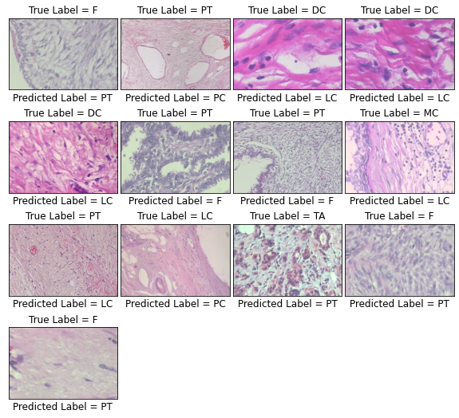

# Breas-Cancer-Classification
Breast cancer classification using vision transformers and transfer learning

## Citing

If you find this code useful in your research, please consider citing the paper:

```
@article{alotaibi2022vit,
  title={ViT-DeiT: An Ensemble Model for Breast Cancer Histopathological Images Classification},
  author={Alotaibi, Amira and Alafif, Tarik and Alkhilaiwi, Faris and Alatawi, Yasser and Althobaiti, Hassan and Alrefaei, Abdulmajeed and Hawsawi, Yousef M and Nguyen, Tin},
  journal={arXiv preprint arXiv:2211.00749},
  year={2022}
}

```

## Dataset

The dataset can be download from [here](https://web.inf.ufpr.br/vri/databases/breast-cancer-histopathological-database-breakhis/)

This is a multiclass classification problem. I splist the data as shown-

```
Dataset
 Adenosis 
  a1.jpg
  a2.jpg
  //
 Fibroadenoma 
  f1.jpg
  f2.jpg
  //
 Phyllodes Tumor
  p1.jpg
  p2.jpg
  //
 Tubular Adenona
  t1.jpg
  t2.jpg
  //
 Ductal Carcinoma
  d1.jpg
  d2.jpg
 Lobular Carcinoma
  l1.jpg
  l2.jpg
  //
 Mucinous Carcinoma
  m1.jpg
  m2.jpg
  //
 Papillary Carcinoma
  p1.jpg
  p2..jpg
  //...
```

## Models
The models trained on BreakHis dataset, that used in the paper:

`google/vit-base-patch16-224`

`facebook/deit-base-patch16-224`

## Important 

In ensemble model, use same training set and testing set for both models, so that you get accurate results.

## Environment and tools

1. numpy
2. matplotlib
3. sklearn
4. seaborn
5. tqdm
6. torch
7. tabulate

## Installation

`pip install transformers`

## Results

### Confusion Matrix


### ROC curve


### Misclassfication samples



### Attention map 

Google model after training on BreakHis dataset


Facebook model after training on BreakHis dataset


## References

1. F. A. Spanhol, L. S. Oliveira, C. Petitjean, and L. Heutte, “A dataset for
breast cancer histopathological image classification,” Ieee transactions
on biomedical engineering, vol. 63, no. 7, pp. 1455–1462, 2015.

2. A. Dosovitskiy, L. Beyer, A. Kolesnikov, D. Weissenborn, X. Zhai,
T. Unterthiner, M. Dehghani, M. Minderer, G. Heigold, S. Gelly, et al.,
“An image is worth 16x16 words: Transformers for image recognition
at scale,” arXiv preprint arXiv:2010.11929, 2020.

3. H. Touvron, M. Cord, M. Douze, F. Massa, A. Sablayrolles, and
H. J´egou, “Training data-efficient image transformers & distillation
through attention,” in International Conference on Machine Learning,
pp. 10347–10357, PMLR, 2021.


## License

```

```
